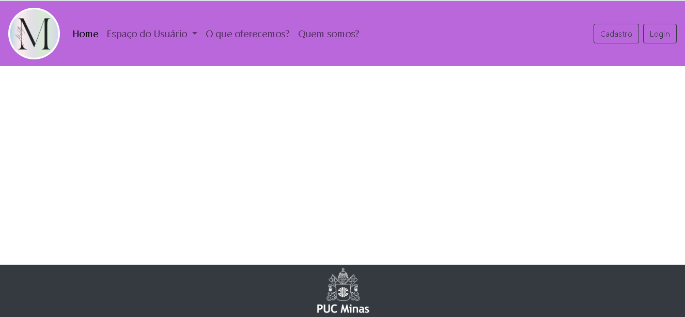
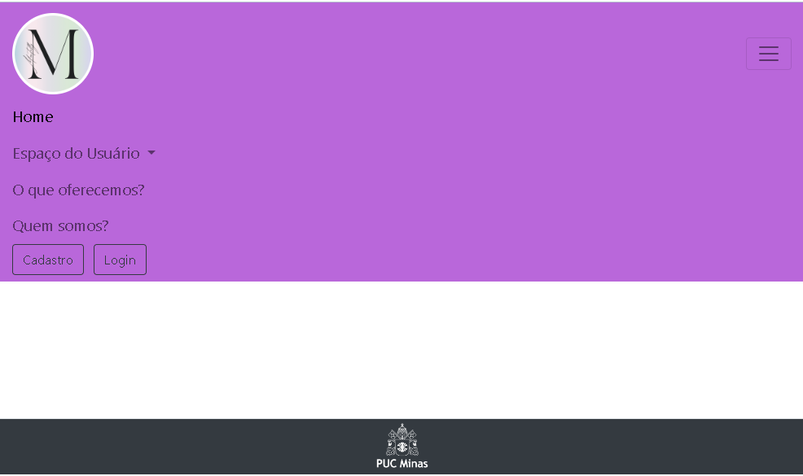

# Template padrão do site

Layout padrão do site (HTML e CSS) que será utilizado em todas as páginas com a definição de identidade visual, aspectos de responsividade e iconografia.

 
 

  <h5>Template</h5>
 
 
 
 
 

  <h5>Template responsivo</h5>
 
 
 
 
 

  <h5>Iconografia</h5>
 
 

