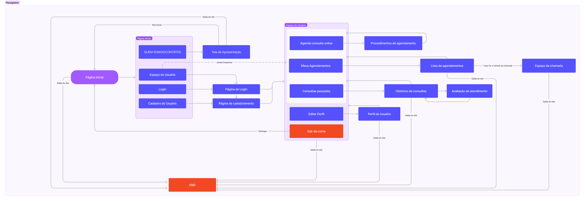
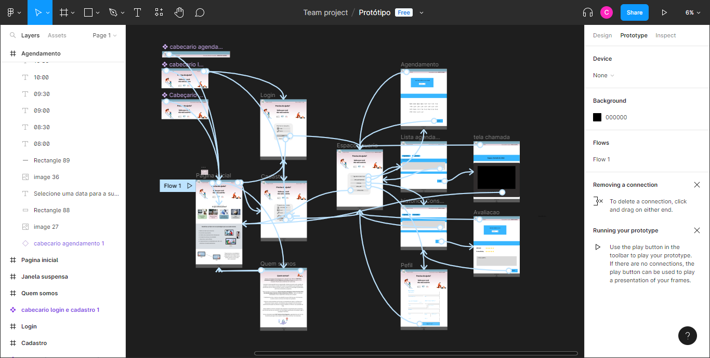

# Projeto de Interface

## User Flow

 
 
 

Para que o site que ofereça suporte emocional e psicológico aos usuários possa funcionar em conformidade, é necessário que ele atenda a diversos requisitos funcionais. Por exemplo, o site permitirá que os usuários agendem e programem encontros com profissionais da área da psicologia, além disso, o site oferecera uma janela suspensa como função de atalho para o usuário, para que ele possa acessar rapidamente as funcionalidades do site. Outras funcionalidades importantes incluem a possibilidade de o usuário realizar um login de acesso a todas as funcionalidades da aplicação e avaliação das consultas. 

Para garantir a melhor experiência para o usuário, o site também atendera a diversos requisitos não funcionais, como ser responsivo e permitir a visualização em um celular de forma adequada, processar requisições do usuário em no máximo 3 segundos compatível, ser com os principais navegadores do mercado e realizar o login em até 10 segundos. Por fim, o site será publicado em um ambiente acessível publicamente na Internet, como Repl.it, GitHub Pages ou Heroku. Ao atender a esses requisitos, o site fornecera um ambiente seguro e eficaz para o suporte emocional e psicológico dos usuários. 

RF-01 O site tem que conseguir agendar e programar encontros com profissionais da área da psicologia  
RF-03 O site deve oferecer uma janela suspensa como função de atalho para usuário 
RF-04	O site deve conter artigos, pesquisas e material sobre doenças mentais, métodos de autoajuda, estabilidade emocional e contatos de apoio	 
RF-07 O site deve permitir o usuário realizar um login de acesso a todas as funcionalidades da aplicação 
RF-08 O site deve possibilitar avaliar o atendimento das consultas 
RF-11 O site deve permitir que o usuario atualize seus dados a qualquer momento (perfil) 
RF-12 O usuário terá acesso ao histórico de consulta 
RF-013	O site deverá conter frases de apoio para o usuário na homepage 
RF-014	O site deverá, após o login, conter o nome do usuário na barra de navegação 
 
## Wireframes

Link para Protótipo: https://www.figma.com/proto/ypTfUqnE9Zg4ace1mhXRLm/Prot%C3%B3tipo?scaling=min-zoom&page-id=0%3A1&starting-point-node-id=189%3A70&node-id=189-70
 
 

 
   
 
 
 
 
   
   
     
   
   
   
   

 

